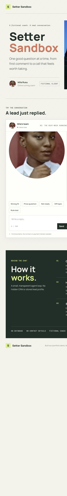

# Setter Sandbox

**A live demo of an AI appointment setter.** You play a lead who just commented on a coach's post. The AI qualifies you in a natural conversation, handles your objections, and books a (fake) call, while a live panel shows what the agent is thinking.

**Try it:** [sandbox.balanconstantin.com](https://sandbox.balanconstantin.com)



Built by [Constantin Balan](https://balanconstantin.com). The idea comes from my startup Hive Setting, where the production version of this agent has handled 30,900+ conversations and booked 4,300 sales calls. This demo is rebuilt from scratch for a fictional client, **Mila Rusu, an online running coach** who sells a 12 week programme for a first half marathon. All names, offers and conversations are fictional.

## What it shows

- **A realistic sales conversation:** one question at a time, no pressure, and polite handling of the usual objections (price, time, "I'll think about it").
- **A live Agent view** next to the chat, updated after every message:
  - the current **stage**: opener, qualifying, objection, booking, booked or disqualified
  - the **lead details** it has extracted so far: running level, goal, deadline, past blocker, time per week and readiness
  - a **lead score** from 0 to 100 with a one line reason
- **A booking flow:** qualified leads are offered two time slots and get a confirmation card with the summary a sales closer would receive. Leads who aren't ready are disqualified politely and offered a free 3 run weekly planner instead.

## How it works

1. The browser keeps the conversation and the current Agent view in memory, and sends the recent messages to a single Cloudflare Pages Function.
2. The function calls **Cloudflare Workers AI** and asks the model for a **JSON object** on every turn: the reply plus the stage, lead fields and score.
3. Before anything reaches the page, the response is **validated**: the JSON schema, whether the stage change is allowed, the lead fields, the score range, and that a booking only confirms one of the two slots just offered.
4. If the model returns invalid output, the demo keeps the last valid Agent view and shows a short recovery reply instead of breaking.

The stage rules are strict: a call can only be booked once every lead field is filled in and the lead is marked as ready.

## Tech stack

| Part | Choice |
| --- | --- |
| Frontend | Plain HTML, CSS and JavaScript |
| Backend | Cloudflare Pages Functions |
| AI model | `@cf/meta/llama-3.3-70b-instruct-fp8-fast` on Workers AI (JSON mode) |
| Rate limiting | Cloudflare Workers KV |
| Tests | Unit tests for the conversation logic, plus seven scripted API scenario and quota tests |

The model name lives in one place (`src/config.js`), and the provider sits behind a small adapter (`src/providers.js`), with a stub ready for an Anthropic adapter.

## Safeguards

**Cost:** the demo runs entirely on the Workers AI free daily allowance, with no paid API and no API keys.
- Max 20 messages per session, 24 requests per visitor per 10 minutes, and 40 model calls per day for the whole demo.
- Replies are capped at 220 tokens, and only the recent conversation is sent to the model.
- By my estimate, a full day at the cap uses about 45% of the free allowance, leaving room for spikes. Visitors see a friendly message when a limit is reached, and the daily cap resets at 00:00 UTC.

**Privacy:**
- No database, no stored transcripts, no conversation logging and no browser storage.
- The rate limit counters store only hashed visitor and session IDs, and they expire automatically.
- Anything that looks like an email address or phone number is removed before it reaches the model.

**Behaviour:**
- The agent refuses off topic requests and attempts to change its instructions.
- It never asks for contact or payment details, and a final check enforces this on every reply.
- No real calendar, payment, email or phone service is connected.

## Run it locally

Requirements: Node.js 20 or newer, and a Cloudflare account with Workers AI enabled.

```bash
npm install
npx wrangler login   # only if this machine isn't logged in yet
npm run dev          # starts the site with local AI and KV bindings
```

Open the URL Wrangler prints (usually `http://localhost:8788`). Local AI requests also count toward your Cloudflare free daily allowance.

Run the tests (no live model calls):

```bash
npm test
```

## Deploy to Cloudflare Pages

1. Create the KV namespace: `npx wrangler kv namespace create LIMITS`, then put its ID in `wrangler.toml` in place of the placeholder.
2. Connect this repository to a Cloudflare Pages project, with build command `npm run build` and output directory `dist`.
3. In the project's **Settings, Bindings**, add a **Workers AI** binding named `AI` and a **KV namespace** binding named `LIMITS`, for both production and preview.
4. Deploy, and check both bindings are present in production before sharing the link.
5. To use a custom domain, open **Custom domains** in the Pages project and add it. If the domain is on Cloudflare, the DNS record and HTTPS are set up automatically.

## License

This project is licensed under the **MIT License**: you are free to use, copy and modify the code, as long as you keep the copyright notice. See the [LICENSE](LICENSE) file for the full text.

Copyright (c) 2026 Constantin Balan